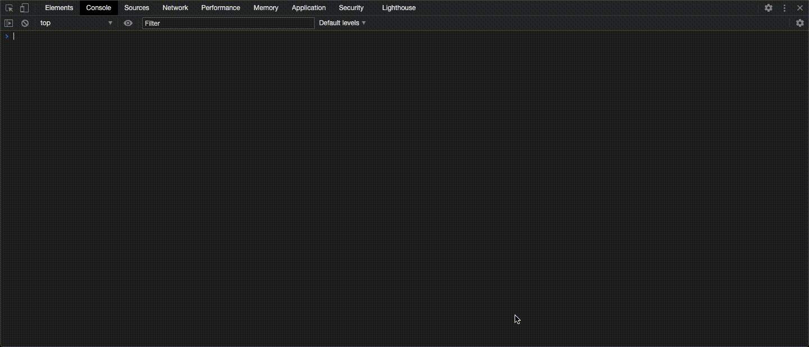

Accessing a non-existent property of an object returns `undefined`. It does not raise an exception. JavaScript treats `undefined` just like another value. It allows performing comparisons with it. For example, `undefined > 5` does not raise an exception. It simply returns `false`.

The problem with this is, when you mistype/misspell an object property, there is no indication about this in JavaScript. Since a non-existent property simply returns `undefined`, and since JavaScript simply treats `undefined` like a regular value, your program will just break and you won't have any idea about the reason. An example:

```javascript
const a = [1,2,3];
if (a.len !== 3) console.log("a's length is not 3!");
```

The code above will print "a's length is not 3!". Because of a simple mistyping, our program is broken without any indications. We have typed `a.len` instead of `a.length`. Since returning `undefined` when accessing a non-existent property (and not throwing an exception, printing a warning, etc.) is the default behavior in JavaScript, we didn't get any indication/warning about this.

The solution to this is to [use TypeScript][My answer about non-existent property access]. Had we used TypeScript, we would have gotten an error right on the "compile time" (that is, on our editor before we even run the code) saying `Property 'len' does not exist on type 'number[]'` and underlining the erroneous part of the code with red squiggles.

[My answer about non-existent property access]: https://stackoverflow.com/a/63548095/3395831

----

You cannot create an array of arrays using [`Array.prototype.fill()`]. Specifically, you cannot create an array of objects using `Array.prototype.fill()`, because every element in the array will be the _exact same object_. Hence, modifying _any_ element of the array modifies _every_ element of the array, since every element is the _exact same element_ (same reference). Example:

```javascript
const a = Array(5).fill(Array(3).fill(null));
/*
 * a is:
 *
 * [[null, null, null]
 *  [null, null, null]
 *  [null, null, null]
 *  [null, null, null]
 *  [null, null, null]]
 */
a[2][1] = 'A';
/*
 * a is:
 *
 * [[null, "A", null]
 *  [null, "A", null]
 *  [null, "A", null]
 *  [null, "A", null]
 *  [null, "A", null]]
 *
 * instead of
 *
 * [[null, null, null]
 *  [null, null, null]
 *  [null, "A", null]
 *  [null, null, null]
 *  [null, null, null]]
 */
```

Instead, you can use `Array.from(Array(5), () => Array(3).fill(null))` to get the expected behavior.

[`Array.prototype.fill()`]: https://developer.mozilla.org/en-US/docs/Web/JavaScript/Reference/Global_Objects/Array/fill

----

You should never modify in-place an object in JavaScript. If you modify an object in-place that's passed into a function, that modification affects the object where the function is called from as well. Example:

```javascript
const a = [1,2,3];
const b = [4,5,6];

function x(p) {
  p.unshift(0);
  // Or, similarly:
  // for (let i = 0; i < p.length; i++) p[i]++;
}

function y(p) {
  [0, ...p];
}

// Shows [1, 2, 3]
a
x(a)
// Shows [0, 1, 2, 3]
a


// Shows [4, 5, 6]
b
y(b)
// Shows [4, 5, 6]
b
```

This is, in fact, the same behavior with Java. Example Java code:

```java
import java.util.Arrays;

public class HelloWorld {

    static void increment(int[] arr) {
        for (int i = 0; i < arr.length; i++) arr[i]++;
    }

    public static void main(String []args) {
        int[] a = {1,2,3};
        // Prints [1, 2, 3]
        System.out.println(Arrays.toString(a));
        HelloWorld.increment(a);
        // Prints [2, 3, 4]
        System.out.println(Arrays.toString(a));
    }
}
```

In short, in most (all?) object-oriented programming languages, if you modify an object in-place, the modifications are reflected in the calling context. The reason is that the objects are actually passed-by-reference. That is, instead of passing a copy of the object to the function, a _copy of the reference_ is passed to the function. The copy of the reference simply points to the same original object. Hence, any modifications within the function actually modify the object.

----

Optional chaining operator (`?.`) should be used AFTER the element that will be potentially `null`/`undefined`, NOT before. Example:

WRONG:

```javascript
const desiredProp = someVariable?.somePotentiallyNonExistentProperty.desiredProp;
```

RIGHT:

```javascript
const desiredProp = someVariable.somePotentiallyNonExistentProperty?.desiredProp;
```

The reason is that optional chaining operator protects against property accesses on non-existing things (objects, properties, etc.) That is, you place the optional chaining operator NOT BEFORE the thing that has the potential to be non-existent, but AFTER it. The right version of the code above means that "we are sure that `someVariable` will never be non-existent, even if it just an object with no properties in it (that is, an empty object). However, there is a possibility that `somePotentiallyNonExistentProperty` prop of `someVariable` (and in turn, everything that descends from `somePotentiallyNonExistentProperty`) has the potential to be non-existent".

Note that in order to go deeper in the tree of an object, you DO NOT have to use the optional chaining repeatedly. Just using once after the property that has the potential to be non-existent is enough. Example:

```javascript
const a = {p1: {p2: {p3: 'v3'}}};
const b = {};
// 'c' is a variable that can potentially be 'a' or 'b'.
let c;
// Following works perfectly. Essentially it means "c might not have the
// 'p1' prop but if it does, then 'p1' prop will, for sure, have the
// 'p2' prop and 'p2' prop will, in turn, for sure have the 'p3' prop".
c = a;
// Works. Prints "v3".
console.log(c.p1?.p2.p3);
c = b;
// Works. Prints "undefined". That is, it does not throw "TypeError:
// Cannot read property ... of ... at ...".
console.log(c.p1?.p2.p3);
```

The reason that optional chaining works this way is because of "short-circuiting". That is, if the expression *before* the optional chaining operator is non-existent (aka "nullish", that is, `undefined` or `null`), the expression immediately returns `undefined` without even continuing to evaluate the rest of the expression (the rest of the expression is everything that's on the right or bottom side of the same expression). This behavior is named "short-circuiting", and it is the reason that when we set `c = b;` in the example above, `c.p1?.p2.p3` simply returns `undefined` instead of causing a `TypeError` to be thrown.

----

On a (web) browser, DON'T USE `console.log` to inspect something. It is broken. When you log something using `console.log` and then expand it using the little arrow on the output of `console.log`, the values shown will be the values of the logged object _at the time that you have expanded the `console.log` output_. They won't be the values at the time that the object was logged.

That is, say that you logged something using `console.log`. Later, the program changed (mutated) that variable. When you go to the place where the log is and click on the little arrow to expand it, the values shown there are not the values at the time of logging. They are the values at the time that you expand it (by clicking on that little arrow near the log). That is, if you expand it after the program finished execution, it means that the values shown will be the final version of the variable, not the version at the time of logging. Hence, `console.log` cannot be used to inspect a variable.

Even though the little blue information box when we expand a console log says "Value below was evaluated just now", the truth is, value shown when we expand a console log is evaluated at "the first time when we expand a console log". If we contract a log and then later expand it again, the value will not be re-evaluated. The value obtained the first time when we expanded a log will be shown. Below is a demonstration of this:


Apparently, this has been the behavior the whole time. Here are some Stack Overflow questions from 2010s:

[Can't access object property, even though it shows up in a console log](https://stackoverflow.com/questions/17546953)

[console.log() shows the changed value of a variable before the value actually changes](https://stackoverflow.com/questions/11284663)

[Is Chrome's JavaScript console lazy about evaluating arrays?](https://stackoverflow.com/questions/4057440)

[console.log() async or sync?](https://stackoverflow.com/questions/23392111)

[Bizarre console.log behaviour in Chrome Developer Tools](https://stackoverflow.com/questions/4198912)

[javascript constructor with google chrome bugged?](https://stackoverflow.com/questions/8007397)

Other articles talking about this issue:

[Logging JavaScript Objects](https://code-maven.com/logging-javascript-objects)

[Please stop using console.log(), it’s broken](https://hackernoon.com/please-stop-using-console-log-its-broken-b5d7d396cf15)

A quick and "good enough for most cases" workaround is to serialize and deserialize the object and then log it:

```javascript
function log(object) {
  console.log(JSON.parse(JSON.stringify(object)));
}
```

A more robust solution is to deep clone an object and then simply log the clone. This example is using the [lodash library] to deep clone an object:

```javascript
function log(object) {
  console.log(require('lodash.clonedeep')(object));
}
```

Note that deep cloning still does not work to take a snapshot of object prototype (the `__proto__` property). As far as I can tell, for now, there is no way to take a snapshot of the `__proto__` property:

```html
<!DOCTYPE html>
<html>
<head>
  <script type="module">
    import cloneDeep from 'https://cdn.jsdelivr.net/npm/lodash-es@4.17.15/cloneDeep.js';

    function log(object) {
      console.log(cloneDeep(object));
    }

    function A() {}

    const a = new A();
    log(a);
  </script>
</head>
</html>
```

When we expand the log output of the code above, we observe the following output:

<pre>
A {}
  __proto__:
    constructor: ƒ A()
      arguments: (...)
      caller: (...)
      length: 0
      name: "A"
      <b>prototype: {constructor: ƒ}:</b>
        ...
      ...
    __proto__: Object:
      ...
</pre>

Note how `a.__proto__.constructor.prototype` has a value (that is, it is not null).

Now, we add the line `A.prototype = null;` after the last line, save the HTML file and refresh the web page. When we expand the console output, we observe:

<pre>
A {}
  __proto__:
    constructor: ƒ A()
      arguments: (...)
      caller: (...)
      length: 0
      name: "A"
      <b>prototype: null</b>
      ...
    __proto__: Object:
      ...
</pre>

Again, the same issue with `console.log` without deep cloning. I can tell that this is the same (or very similar) issue with that, because instead of entering the JavaScript code on an HTML file and opening the HTML file on a browser, when we just open a browser console without any HTML file and run:

```javascript
function A() {}

const a = new A();

console.log(a);
```

and then expand the log value, we observe that `a.__proto__.constructor.prototype` is not null. Then, when we collapse the log output, execute the line `A.prototype = null;` and re-expand the log output, we observe that `a.__proto__.constructor.prototype` is still not null.

On the other hand, if we just execute:

```javascript
function A() {}

const a = new A();

console.log(a);

A.prototype = null;
```

and then check out the log output by expanding it, we observe that `a.__proto__.constructor.prototype` is null. Hence, this is again the same issue. That is, the log output shown in expanded view are evaluated _at the time that we expand it_. Not at the time of logging. Here is a GIF that demonstrates this:



On another note, even the [MDN notes] suggest not to use `console.log` directly. They suggest to use at least `JSON.stringify`. The same page also says:

> Please be warned that if you log objects in the latest versions of Chrome and Firefox what you get logged on the console is a reference to the object, which is not necessarily the 'value' of the object at the moment in time you call console.log(), but it is the value of the object at the moment you open the console.

[This is the issue][Chromium issue] that I have created on Chromium bug tracker to change the on hover message on the little blue information box that appears when we expand a `console.log` output from "Value below was evaluated just now" to "Value below was evaluated the first time that you have expanded the log output".

One more note: You might think that using `Object.entries` will be a solution to this, but `Object.entries` is essentially the same thing as making a shallow copy. Example:

```javascript
const arr = {a: [0,1,2,3]};
arr.a[0] = -1;
console.log(Object.entries(arr));
arr.a[1] = -1;
console.log(Object.entries(arr));
arr.a[2] = -1;
console.log(Object.entries(arr));
arr.a[3] = -1;
console.log(Object.entries(arr));
```

The problem persists here as well. When you expand the log outputs, you observe all elements of the array are -1, instead of the values at the time that they were logged.

[lodash library]: https://lodash.com/
[MDN notes]: https://developer.mozilla.org/en-US/docs/Web/API/Console/log#Logging_objects
[Chromium issue]: https://bugs.chromium.org/p/chromium/issues/detail?id=1141675

----

You don't need to wrap an invocation of a "constructor function" within parentheses to access a property on the returned (created / initialized) object. It is redundant. That is, it will work just fine without wrapping it:

```javascript
'use strict';

function a() {
  this.x = 1;
  this.y = 2;
}

a();
// Gives:
// Uncaught TypeError: Cannot set property 'x' of undefined

// CORRECT:
new a().x
// Evaluates to 1. Hence, this shows that we don't need to wrap an
// initialization statement within parentheses in order to access a
// property on the returned (created / initialized) object.

// REDUNDANT / NEEDLESS:
(new a()).x
// Again, evaluates to 1, but it is pointless / redundant.
```

----

You cannot add properties to primitive types
============================================

```javascript
let a = 1;
a.someProp;
// undefined
a.someProp = 5;
// 5
a.someProp;
// undefined

// Another example
let b = 'hello';
b.anotherProp;
// undefined
b.anotherProp = 10;
// 10
b.anotherProp;
// undefined
```

The [primitive types] in JavaScript are:
- string
- number
- boolean
- symbol
- bigint
- undefined

Although `null` seems like a primitive, it is a special case of the Object type, though it behaves like a primitive for most purposes.

Everything else are instances of the Object type or a descendant of the Object type.

[primitive types]: https://developer.mozilla.org/en-US/docs/Glossary/Primitive
