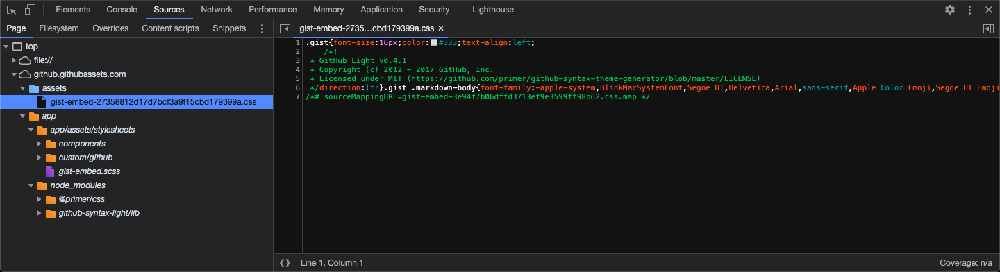

When a browser gets a 404 (HTTP NOT FOUND) for a favicon request, the browser WILL NOT try to make another HTTP request for the favicon _to that domain_, until the browser is restarted
=========================================================================================================================================================================================

That is, until you quit the browser process and start it again. Opening an incognito window and trying the request again or clicking on "Developer Tools -> Application -> Clear storage -> Clear site data" DOES NOT work either. The only thing that works is to restart the browser. Until the browser has been restarted, the browser WILL NOT make an HTTP requests to get the favicon _from that domain_.

[Source](https://stackoverflow.com/a/43173871/3395831)

---

Source Maps
===========
Source maps are files understood by web browsers that maps a specific location (any location actually) in a minified file to its location in the original, source, un-minified file. This helps the developer much better understand where the source of the problem is and how to debug it.

An example is the GitHub gist embed stylesheet file. The embed links for a GitHub gist is a JavaScript file which contains two `document.write` statements. The first one of these statements contain an HTML `<link>` attribute that points to a stylesheet file. That link is:

    https://github.githubassets.com/assets/gist-embed-27358812d17d7bcf3a9f15cbd179399a.css

When we HTTP GET that file, we observe that it is a minified CSS file. However, we also notice a line at the end of that file. That line is:

    /*# sourceMappingURL=gist-embed-3e94f7b06dffd3713ef9e3599ff98b62.css.map */

This is a source map declaration. While parsing the CSS file, the browser detects this line and makes another HTTP GET request to obtain (download, etc.) that source map. Note that the HTTP request to obtain the source map and all its relevant files are not shown in the "Network" tab of developer tools. Again, the URL to the source map is:

    https://github.githubassets.com/assets/gist-embed-3e94f7b06dffd3713ef9e3599ff98b62.css.map

We need to navigate to that link using an HTTP agent (such as a web browser, cURL, etc.) and make a GET request. For simplicity, we use a web browser for this. When we navigate to that link using a web browser (and hence, when the web browser makes an HTTP GET request), the web browser wants to download a file. Downloading that file and opening it on a text editor reveals:

```json
{
  "version": 3,
  "sources": [
    "../../app/app/assets/stylesheets/gist-embed.scss",
    "../../app/node_modules/@primer/css/support/variables/typography.scss",
    "../../app/node_modules/github-syntax-light/lib/github-light.css",
    "../../app/node_modules/@primer/css/markdown/markdown-body.scss",
    "../../app/node_modules/@primer/css/base/kbd.scss",
    "../../app/node_modules/@primer/css/support/variables/color-system.scss",
    "../../app/node_modules/@primer/css/support/variables/misc.scss",
    "../../app/node_modules/@primer/css/support/variables/layout.scss",
    "../../app/node_modules/@primer/css/markdown/headings.scss",
    "../../app/node_modules/@primer/css/support/variables/colors.scss",
    "../../app/node_modules/@primer/css/markdown/lists.scss",
    "../../app/node_modules/@primer/css/markdown/tables.scss",
    "../../app/node_modules/@primer/css/markdown/images.scss",
    "../../app/node_modules/@primer/css/markdown/code.scss",
    "../../app/node_modules/@primer/css/markdown/blob-csv.scss",
    "../../app/app/assets/stylesheets/components/breadcrumb.scss",
    "../../app/app/assets/stylesheets/custom/github/blob.scss",
    "../../app/node_modules/@primer/css/support/mixins/layout.scss",
    "../../app/app/assets/stylesheets/components/diffs-blobs.scss",
    "../../app/app/assets/stylesheets/custom/github/task-lists.scss"
  ],
  "names": [],
  "mappings": "AAUA,MACE,eCKY,ADHZ,WAAW,AACX,gBAAgB;IEdlB;;;;GAIG,AFmBD,aAAc, <lots more, seemingly random, comma-separated, character sequences>",
  "file": "gist-embed-27358812d17d7bcf3a9f15cbd179399a.css"
}
```

As you can observe, there are a lot of files specified as the sources. Upon receiving the source map, the browser makes more HTTP GET requests to them (again, behind the scenes. That is, they are not shown on the "Network" tab of the developer tools) and places them on the appropriate directory structure on "Sources" tab of the developer tools. A very important thing that the browser does in order to help the developer distinguish between the real source files versus the files obtained as a result of a source map is that the browser shows real source file directories in blue color, whereas showing source map directories in orange color:


